# Create a DeepLens Inference Lambda function

## In this module, you will learn to create an inference lambda function to be deployed to your DeepLens.

## The inference lambda function will crop the identified faces and upload them to your S3 bucket. 

In this module, you will learn to create an inference lambda function for your DeepLens. This lambda function will crop the identified faces and upload them to your S3 bucket.

Before you start with the steps below, please ensure you register your DeepLens device.

**Step 1- Create IAM roles**

1. We need to first set permissions for the roles the Lambda functions will be using.

 

First, we need to add S3 permissions to the DeepLens Lambda role so the lambda on the device can call Put Object into the bucket of interest.

2. Go to console.aws.amazon.com and search for IAM
3. Go to the “Roles” page on the IAM console. Look up the role “AWSDeepLensLambdaRole”

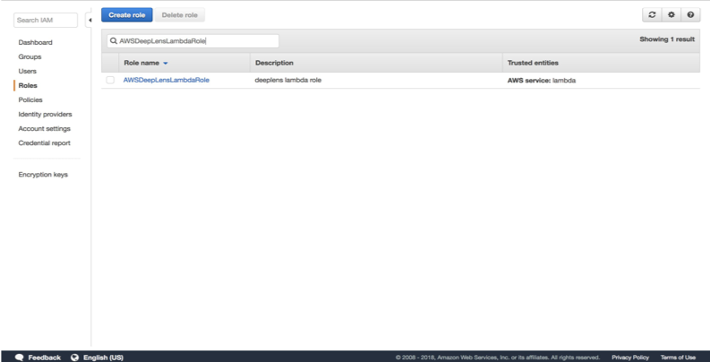

 

4. Click on the Role, Click Attach Policy, and attach “AmazonS3FullAccess”

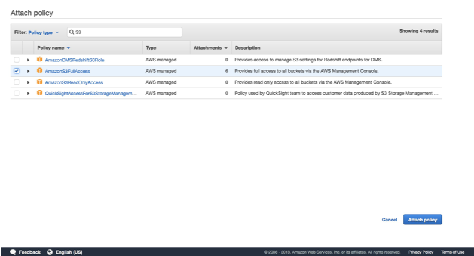

 

5. Now we have to create a role for Rekognition Lambda. From “Create Role”, Select “AWS Service” and select “Lambda”:

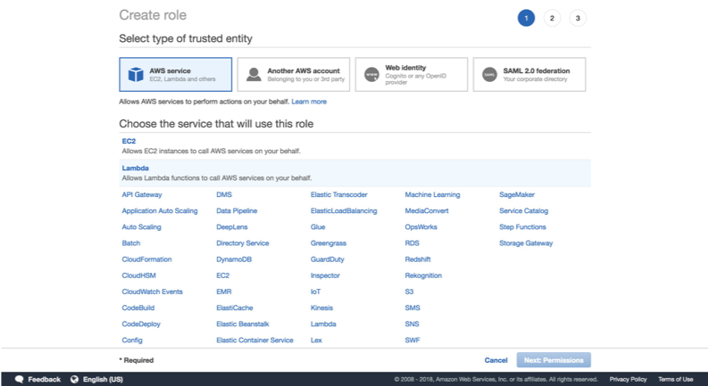

 

6. Attach the following policies: 

·      AmazonDynamoDBFullAcces

·      AmazonS3FullAccess

·      AmazonRekognitionFullAccess

·      CloudWatchFullAccess

 

7. And create the role “rekognizeEmotion”:

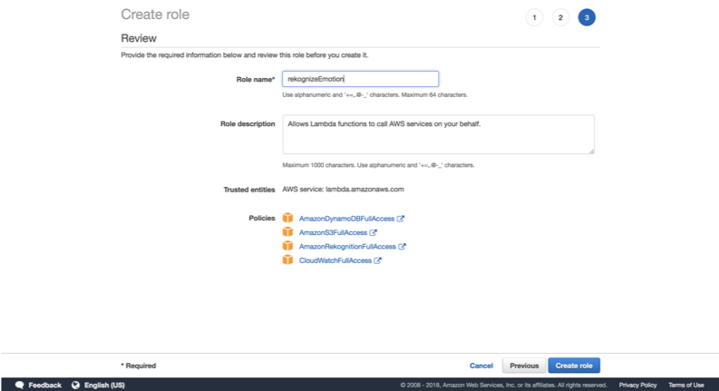

 

### **Step 2- Create S3 bucket**

 

1. Go to console.aws.amazon.com/s3 
2. Choose ‘Create Bucket’

We need to create an S3 bucket that we can upload faces to. These uploads will trigger our Rekognition lambda.

3. Name your bucket and choose Next. In the next step, create bucket.

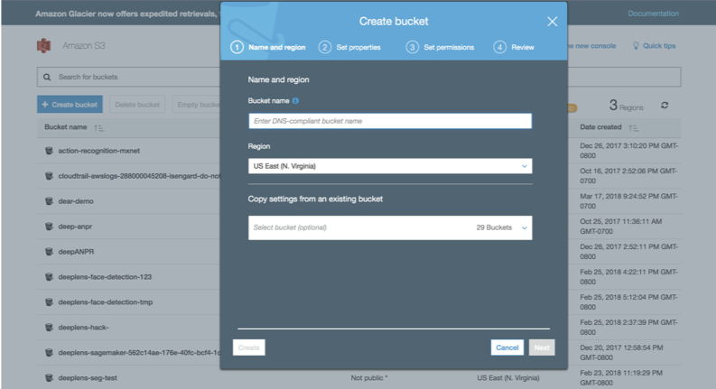

 

Note the name of the bucket, we'll use it in later steps.

### Step 3- Create Lambda Functions

 Next, we need to make the two lambda functions:

·      The greengrass lambda function that runs on the device

·      The cloud lambda that sends faces to Rekognition

 

Step 3.1 - First, we'll create the greengrass Lambda (inference lambda function) that will run on the device:

 

1. Start by creating a function from the “greengrass-hello-world” blueprint:

 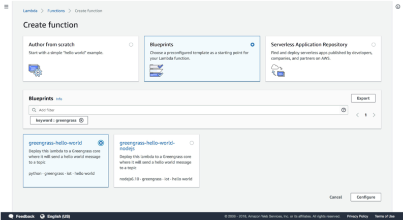

2. Name the function “deeplens-dear-demo”, and attach the AWSDeepLensLambdaRole. Click ‘Create Function’

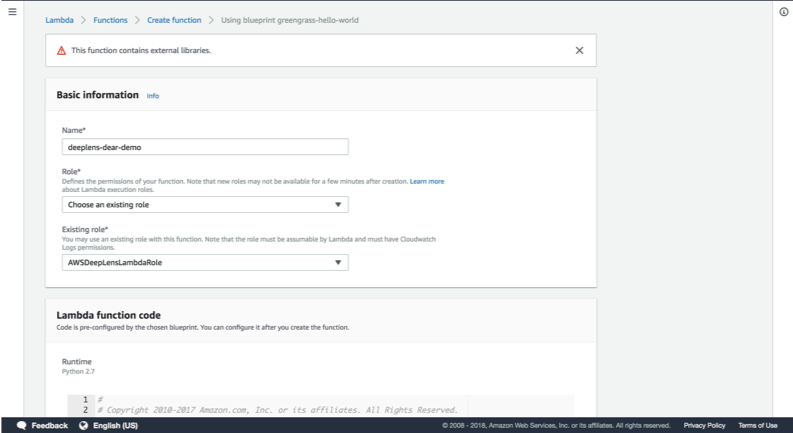

 

 

3. Once created, we're going to replace the default handler code:

 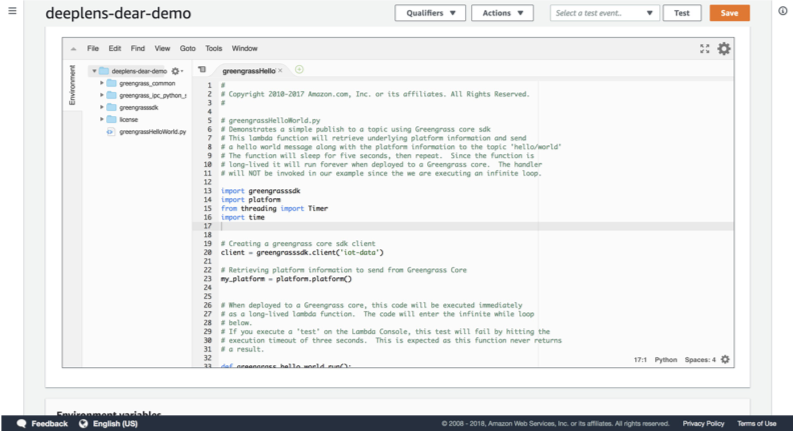

 with the inference script (you can find it in the github folder: **inference-lambda.py**), inserting real values for the following fields:

·      <BUCKET_NAME>: the S3 bucket faces will be written to, which we created above

 

 

Once replaced:

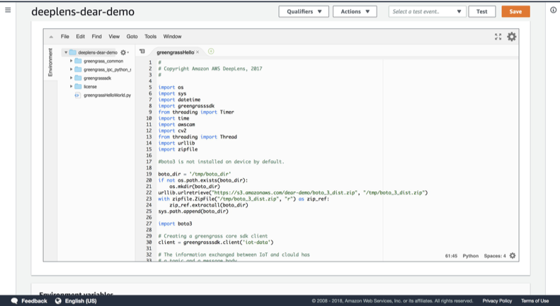

 

**4. Click “Save”, and then under the “Actions” drop-down menu,** 

**5. Click “Publish new version” and publish.**

 

**Step 4- Deploy Project**

1. Login to DeepLens Console – <https://console.aws.amazon.com/deeplens>
2. Click on Create Project button

 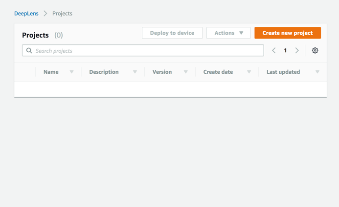

3. Select ‘Use a project template’  
4. Select ‘Face Detection’ from sample project templates
5. Select “Next” at bottom of screen

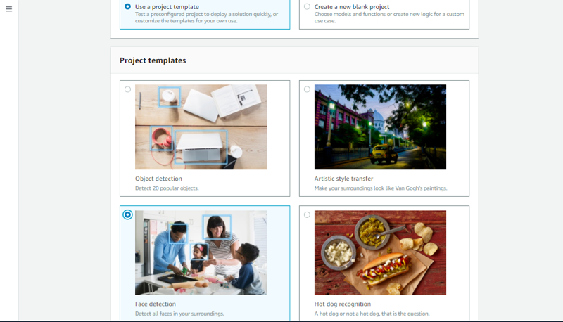

6. Remove the pre-populated function by choosing Remove

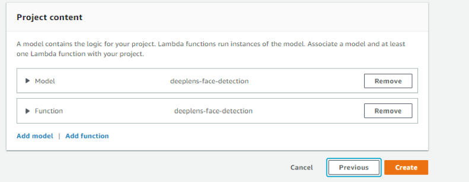

7. Choose ‘Add Function’ and choose the lambda function you just created above.
8. Click ‘Create’
9. Find your project in the list (the one you just created)
10. Select the radio button and click Deploy

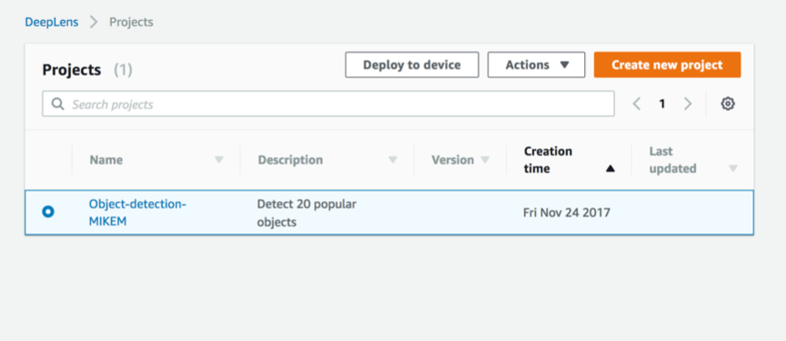

11. Choose your device and  Click ‘Review’ 

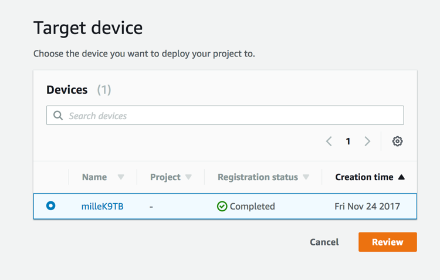

12. Click ‘Deploy’

 

In the next step, we will create a lambda function that run on the cloud. Refer to the document ‘Extend the project by integrating with Amazon Rekognition’ in the repo.

 
