# In this lab we will create a Cat and Dog Image Classification model and deploy that model on Deeplens

To create model please follow notebook 

![]cat-dog-classification-groundtruth.ipynb

We will walk you through deploying a model to classify cat and dog classification model.

Ensure that the mxnet version on your AWS DeepLens is 1.2.0 +. In case you need to upgrade, you can type the following code in your Ubuntu terminal.

sudo pip3 install mxnet==1.2.0

Please create S3 bucket with prefix "deeplens-".
Download attached model.tar.gz file

Now Log into AWS DeepLens Console (https://console.aws.amazon.com/deeplens/home?region=us-east-1#projects)

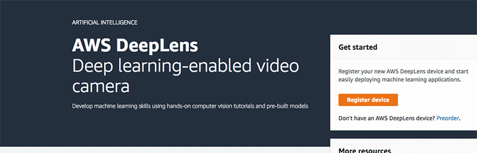


Create new project

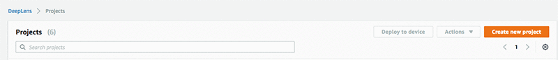

Choose – Create a new blank project

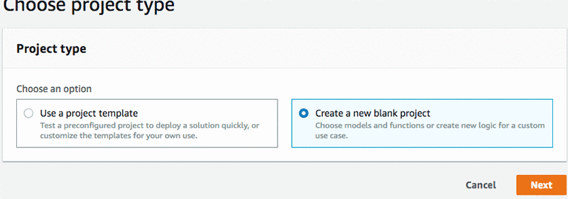

Name project – e.g. catdog-imageclassification
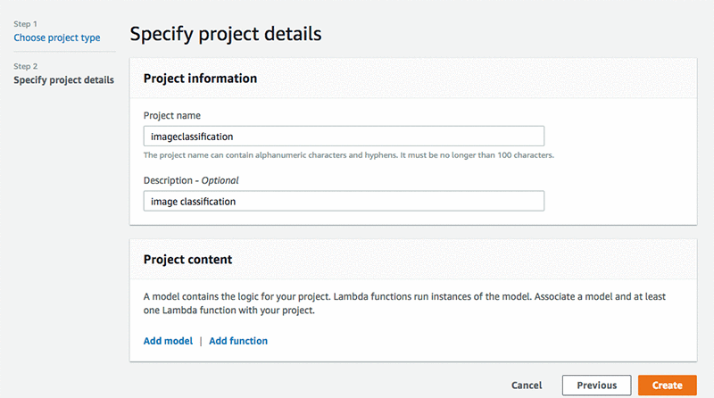

Select Add Model – this will open new page, “Import model to AWS Deeplens”

Select Externally trained model, for source, select S3 bucket you created earlier.


Go back to import model screen, select the imageclassification model you imported earlier, click Add model. Once model is added, you need to add a lambda function by choosing Add function.

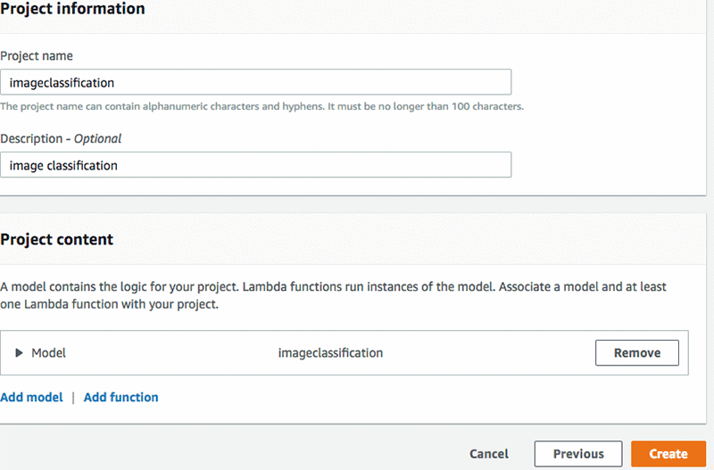

To create a AWS DeepLens lambda function, you can follow the blog post: Dive deep into AWS DeepLens Lambda functions and the new model optimizer.

To provide an easy reference, we have provided the instructions for the lambda function for image classification below.

To create an inference Lambda function, use the AWS Lambda console and follow the steps below:

 1. Choose Create function. You customize this function to run inference for your deep learning models.
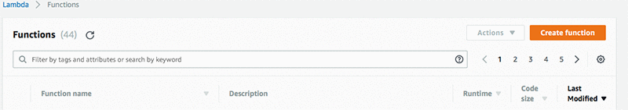

2. Choose Blueprints

3. Search for the greengrass-hello-world blueprint.

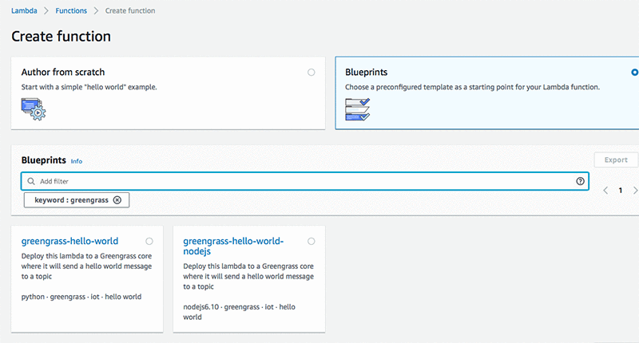

4. Give your Lambda function the unique name  e.g. imageclassification_yourname_lambda.

5. Choose an existing IAM role: AWSDeepLensLambdaRole. You must have created this role as part of the registration process.

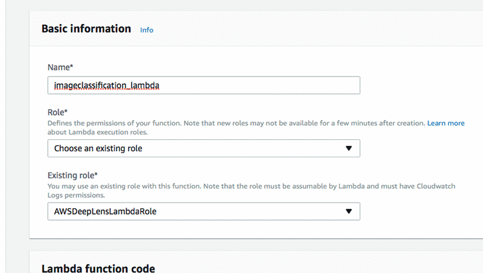

6. Choose Create function.

7. In Function code, make sure the handler is greengrassHelloWorld.function_handler.

8. In the GreengrassHello file, remove all of the code. You will write the code for inference Lambda function in this file.

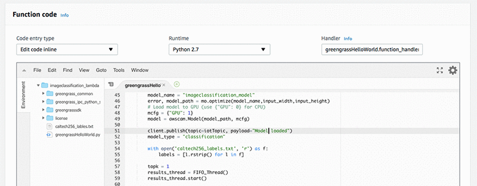

Replace existing code with code below

```
#Insert imageclassification_yourname_lambda.py
#
# Copyright Amazon AWS DeepLens, 2017
#

import os
import greengrasssdk
from threading import Timer
import time
import awscam
import cv2
import mo
from threading import Thread

# Creating a greengrass core sdk client
client = greengrasssdk.client('iot-data')

# The information exchanged between IoT and clould has 
# a topic and a message body.
# This is the topic that this code uses to send messages to cloud
iotTopic = '$aws/things/{}/infer'.format(os.environ['AWS_IOT_THING_NAME'])
jpeg = None
Write_To_FIFO = True

class FIFO_Thread(Thread):
    def __init__(self):
        ''' Constructor. '''
        Thread.__init__(self)
 
    def run(self):
        fifo_path = "/tmp/results.mjpeg"
        if not os.path.exists(fifo_path):
            os.mkfifo(fifo_path)
        f = open(fifo_path,'w')
        client.publish(topic=iotTopic, payload="Opened Pipe")
        while Write_To_FIFO:
            try:
                f.write(jpeg.tobytes())
            except IOError as e:
                continue  

def greengrass_infinite_infer_run():
    try:
        input_width = 224
        input_height = 224
        model_name = "image-classification"
        error, model_path = mo.optimize(model_name,input_width,input_height, aux_inputs={'--epoch': 30})
        # The aux_inputs is equal to the number of epochs and in this case, it is 30
        # Load model to GPU (use {"GPU": 0} for CPU)
        mcfg = {"GPU": 1}
        model = awscam.Model(model_path, mcfg)
        
        client.publish(topic=iotTopic, payload="Model loaded")
        model_type = "classification"
        
        labels = ['cat', 'dog']
	   
        topk = 1
        results_thread = FIFO_Thread()
        results_thread.start()

        # Send a starting message to IoT console
        client.publish(topic=iotTopic, payload="Inference is starting")

        doInfer = True
        while doInfer:
            # Get a frame from the video stream
            ret, frame = awscam.getLastFrame()
            # Raise an exception if failing to get a frame
            if ret == False:
                raise Exception("Failed to get frame from the stream")

            # Resize frame to fit model input requirement
            frameResize = cv2.resize(frame, (input_width, input_height))
        
            # Run model inference on the resized frame
            inferOutput = model.doInference(frameResize)

            # Output inference result to the fifo file so it can be viewed with mplayer
            parsed_results = model.parseResult(model_type, inferOutput)
            top_k = parsed_results[model_type][0:topk]
            msg = '{'
            prob_num = 0 
            for obj in top_k:
                if prob_num == topk-1: 
                    msg += '"{}": {:.2f}'.format(labels[obj["label"]], obj["prob"]*100)
                else:
                    msg += '"{}": {:.2f},'.format(labels[obj["label"]], obj["prob"]*100)
            prob_num += 1
            msg += "}"  
            
            client.publish(topic=iotTopic, payload = msg)
	    cv2.putText(frame, labels[top_k[0]["label"]], (0,22), cv2.FONT_HERSHEY_SIMPLEX, 1, (255, 165, 20), 4)
            global jpeg
            ret,jpeg = cv2.imencode('.jpg', frame)
            
    except Exception as e:
        msg = "myModel Lambda failed: " + str(e)
        client.publish(topic=iotTopic, payload=msg)
    
    # Asynchronously schedule this function to be run again in 15 seconds
    Timer(15, greengrass_infinite_infer_run).start()


# Execute the function above
greengrass_infinite_infer_run()


# This is a dummy handler and will not be invoked
# Instead the code above will be executed in an infinite loop for our example
def function_handler(event, context):
    return
 
```
 

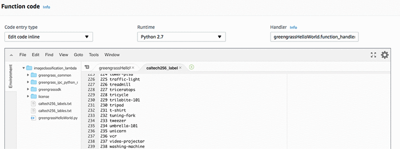

9. Save the lambda function

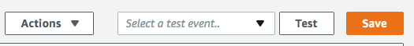

10. Now deploy the lambda function by selecting Actions dropdown button. And then select Publish new version

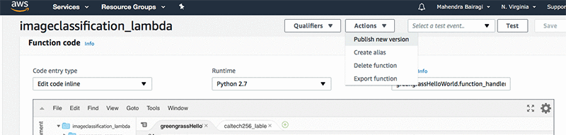


11. This will pop up new box. You can keep version description blank, and choose Publish. This will publish the lambda function.

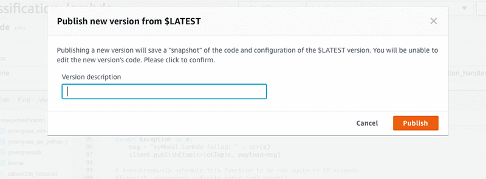

12. Once done, add the lambda function to the project and choose Create new project to finish the project creation.
You will see your project created in the Projects list.

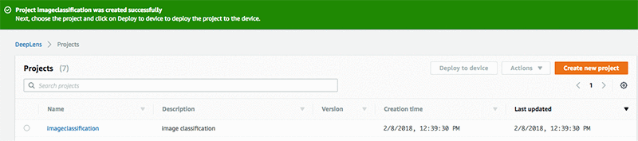
 

13. Once the project is created, select the project and choose Deploy to device. Choose your target AWS DeepLens device. Choose Review.

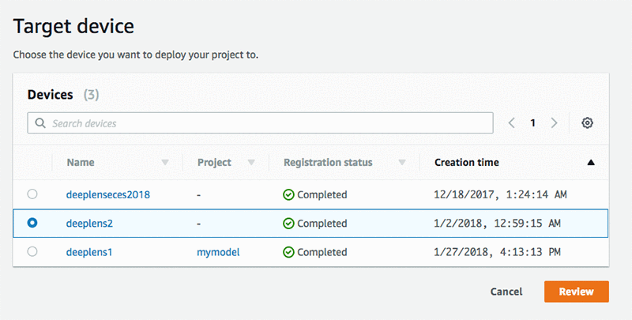


Now you are ready to deploy your own object detection model. Choose Deploy.

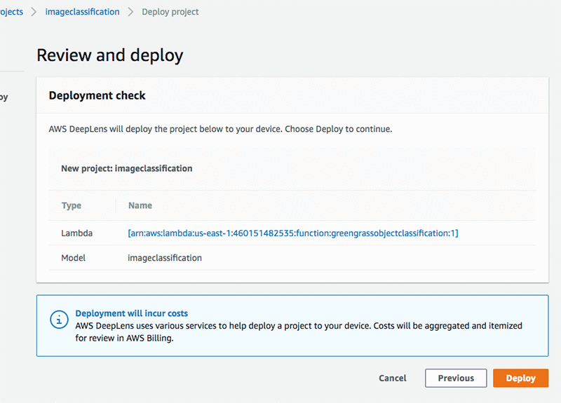
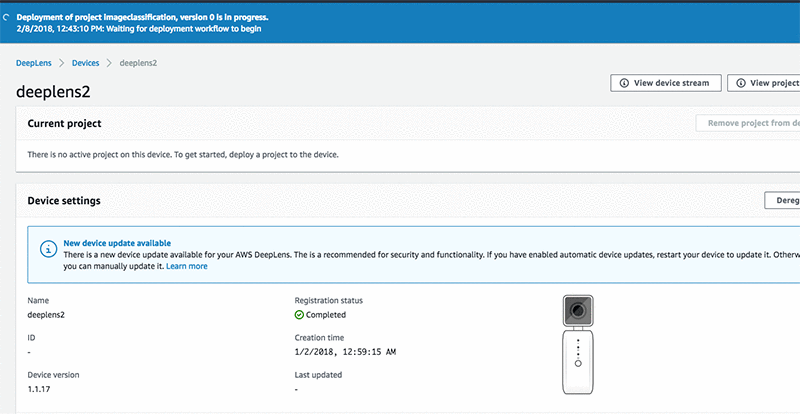

Congratulations! You have built your own object classification model based on a dataset and deployed it to AWS DeepLens for inference.

## View Output

<details> <summary>Deeplens connected over monitor setup </summary>
  
 **Option 1: View over mplayer**
 
To view the output, open a terminal (on the Deeplens desktop UI, choose the top left button and search for terminal) and enter the following command:

`mplayer -demuxer lavf -lavfdopts format=mjpeg:probesize=32 /tmp/results.mjpeg`

 
**Option 2: View over browser**

Step 1- From the left navigation, Choose Devices. Choose your device. Choose View Output


Step 2- Choose Firefox browser for Windows and Mac. Follow the instructions


Step 3- Open a browser tab and navigate to https://0.0.0.0:4000

View output and enjoy!
</details>

<details> <summary>Connected over headless mode and using browser on laptop/desktop </summary>
 
 Step 1- From the left navigation, Choose Devices. Choose your device. Choose View Output


Step 2- Choose your browser. Follow the instructions


Step 3- Click on **View stream**

View the output and enjoy!
</details>

<details> <summary>Connected over headless mode and using SSH </summary>

**Option 3: View over SSH **

if you are accessing Deeplens over SSH then use following command over SSH

`ssh aws_cam@$ip_address cat /tmp/\*results.mjpeg |mplayer –demuxer lavf -cache 8092 -lavfdopts format=mjpeg:probesize=32 -`

For streaming over SSH you may need to install mplayer on your laptop by

`sudo apt-get install mplayer`

</details>

Please visit https://docs.aws.amazon.com/deeplens/latest/dg/deeplens-viewing-device-output-on-device.html for more options to view the device stream
