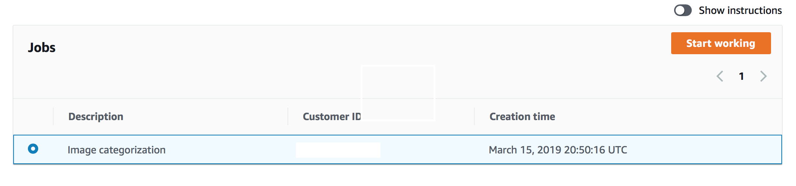
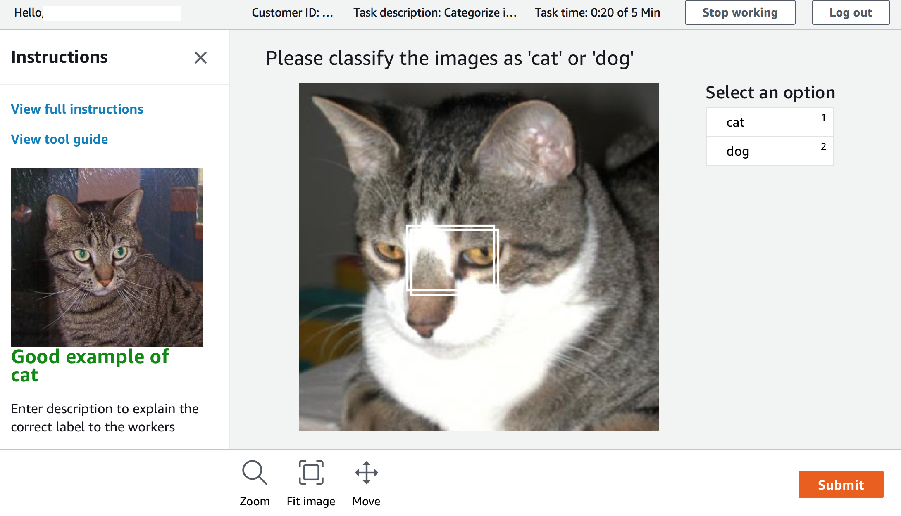

## Prereq for workshop conductors

### GroundTruth lab
Before start, get emails id of attendees

Add attendees you your private workforce

Create S3 bucket for dataset

Copy Cat and Dog dataset

### Create S3 bucket
With name starting with deeplens (For eg., deeplens-deployment-groundtruth-labelling-sagemaker-modeling)

### Create a private GroundTruth Labeling Workforce
* Open Amazon Sagemaker Console and Select "Ground Truth" --> "Labeling workforces".
* Select 'Private' tab.
    * Click 'Create private team'
        * Team name : Enter unique name
        * Add workers : Select 'Create a new Amazon Cognito user group'
        * Create
    * In 'Workers' section
        * Click 'Invite New Workers'
        * Add email addresses separated by ','
        * Invite new workers
    * Click on the new private team created
        * Select 'Workers' tab
        * Click 'Add workers to team'
        * Select and add workers to the team.

### Create GroundTruth Labeling Job
* Open Amazon Sagemaker Console and Select "Ground Truth" --> "Labeling Jobs".
* Click "Create labeling job"
    * Specify job details
        * Job name : groundtruth-labeling-job-cat-dog  (**Note** : Any unique name will do)
        * Input dataset location : Create manifest
            * Entire S3 path where images are located. (**Note** : should end with /)
            * Select 'Images' as data type
            * Once manifest creation is complete, click "Use this manifest"
            * Click Create
        * Output dataset location : Enter S3 bucket path
        * IAM Role
            * Select 'Create a new role' from the dropdown.
        * Task Type
            * Select 'Image classification'
        * Click Next
        * In 'Workers' section, select 'Private' and select the workforce team created in the previous step.
        * In 'Image classification labeling tool'
            * Enter "Please classify the images as 'cat' or 'dog'" in the textbox as an instruction to the workforce.
            * Add two classes 'cat' or 'dog'
            * Link to a good and bad examples of cats from the S3.  (**Note** : Make sure these objects are public in S3)
        * In Advanced Setting
            * Enable AutoLabeling.
            * Number of workers per job : 9 (IS THIS TRUE??)
    * Submit
    * Optional : Examine the input manifest file created in the S3 bucket.  The manifest file will have entries like : {"source-ref":"s3://deeplens-deployment-groundtruth-labelling-sagemaker-modeling/dataset/12.jpg"}

### Monitor the GroundTruth Labeling Job
* Make sure all workers in the workforce received an invitation.
* Once the job is submitted, each worker's portal will show the jobs.
* Examine and show the intermediate output.manifest file.  It will have entries like : {"source-ref":"s3://deeplens-deployment-groundtruth-labelling-sagemaker-modeling/dataset/137.jpg","groundtruth-labeling-job-cat-dog-ml-roadshow":1,"groundtruth-labeling-job-cat-dog-ml-roadshow-metadata":{"confidence":0.77,"job-name":"labeling-job/groundtruth-labeling-job-cat-dog-ml-roadshow","class-name":"dog","human-annotated":"yes","creation-date":"2019-03-16T02:58:33.128987","type":"groundtruth/image-classification"}}

In source - select s3 bucket where dataset is, create manifest file

give output bucket

next screen, choose private workforce you created

Create two classes - cat and dog

Make sure automatic labeling checkbox is enabled

set one worker for one image

Create job

## Instructions for attendees

### Labeling

* You should receive an email with subject "You're invited by AWS to work on a labeling project."
* Navigate to webpage in the email and change your password.
* Once you receive labeling job, the protal view is similar to below.

* Click 'Start Working'. View changes to

* For each image, clasify as '1 Cat' or '2 Dog' and submit.

### Training:
Use following Sagemaker notebook for training

https://github.com/mahendrabairagi/DeeplensWorkshop/blob/master/SageMakerImageClassification/cat-dog-classification-groundtruth.ipynb

### Deploy:
Once training is done - use lab https://github.com/mahendrabairagi/DeeplensWorkshop/blob/master/SageMakerImageClassification/CatAndDogClassification.md
(may needs changes) to deploy model on Deeplens
